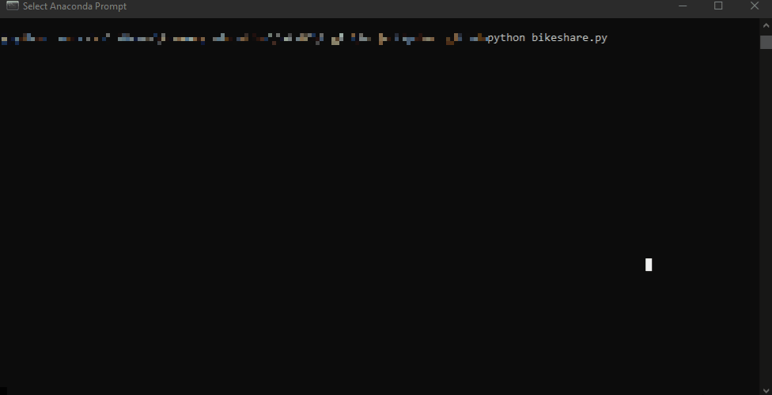

### Date created

This project was created on the 2nd of May 2020.

### Project Title

Explore US Bikeshare Data

### Description

The project is about exploring the U.S bicycle-sharing system data by using Python. In this project the bike share systems in Chicago, New York City and Washington are investigated. First the data was imported and then a script was created to create an interactive experience to present statics of the bike share data.

Bicycle-sharing companies allow people to rent out bikes for a short term for a price. The bike can be rented through an phone application and then the customer can pick up the bike and return it either to the same location or a different one. There are several locations to pick-up and drop-off the bike.

The bikeshare data consits of randomly selected data of the first six months of 2017. The following information is provided for all three cities: 

   - start time 
   - end time
   - trip duration in seconds
   - start station 
   - end station 
   - user type 

For Chigaco and New York City there are also information of:

   - gender
   - birth year

The bikeshare.py file is set up as a script and it will take the raw input to create an interactive exprerience in the terminal. Depending what the user's input to the terminal is, the answers to the questions will change. The user can filter the information by the city, month and weekday. The following questions were answered in the project:

   - most popular month, day of week and start hour
   - number of unique stations
   - most commonly used start and end station
   - most frequent combination of start station and end station trip
   - total and mean travel time
   - count of gender (only for Chicago and NYC) and user types
   - displaying earliest, most recent, and most common year of birth (only for Chicago and NYC)

The code is handling also unexpected user input without failing. A message about the incorrect input is shown to the user in the terminal, asking the user to try again. It is also possible for the user to see the raw data five rows at a time if they wish to do so. In the end the user is asked if they want to start again or exit.

In this project the following packages were used: 
   - time
   - pandas
   - numpy 

### Files used

The following data files were used for the input: 
- chicago.csv
- new_york_city.csv
- washington.csv

The following script was used to process the input data and user input, to produce the expected report on the bikeshare data: 
- bikeshare.py

### Credits
The author is Katariina Peltomäki. The data was provided by [Motivate](https://www.motivateco.com/) through [Udacity](https://www.udacity.com/).

